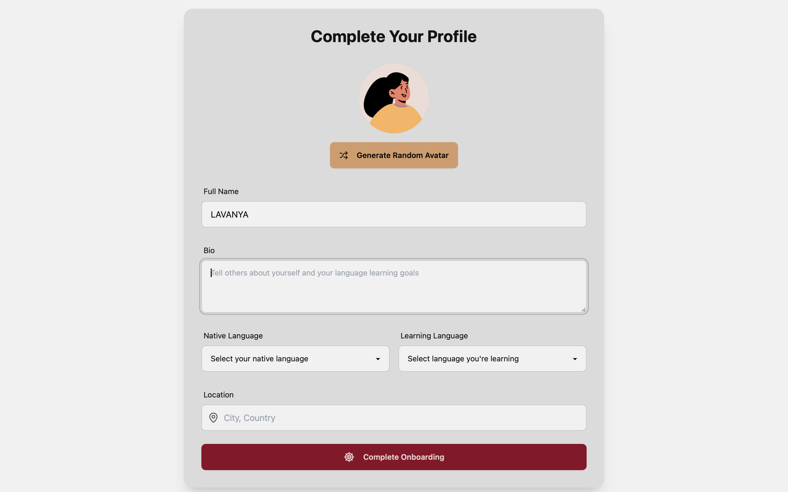
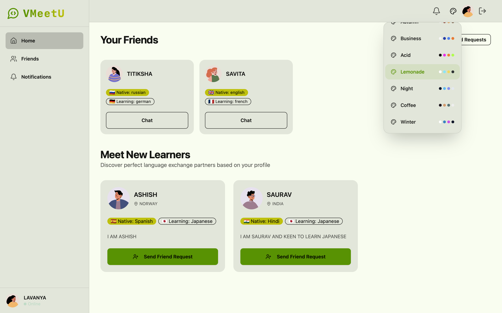
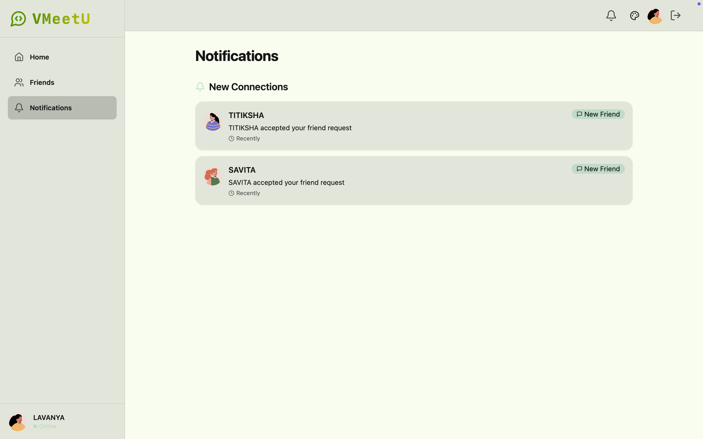

# VMeetU – Language Exchange Platform

VMeetU is a language exchange platform that helps learners connect with each other through real-time chat, video calls, and friend requests.  
It combines social networking and language learning with a smooth user interface and secure authentication system.

---
## Live Demo

- Frontend (Netlify): [https://vmeetu.netlify.app](https://vmeetu.netlify.app)  
- Backend (Render): [https://vmeetu-backend.onrender.com](https://vmeetu-backend.onrender.com)  


## Features

- Authentication & Onboarding  
  - Signup/Login with JWT-based authentication  
  - Profile completion with native/learning language, bio, and location  

- Home Page  
  - Discover new learners to connect with  
  - Send friend requests and manage your connections  
  - View active friends list  

- Notifications  
  - Manage friend requests  
  - View new connections  

- Chat  
  - Real-time messaging with media support  
  - Clean interface for conversations  

- Video Calls  
  - Peer-to-peer video and audio calls  
  - Call controls (mute/unmute, disconnect, etc.)  

- Theme Selector  
  - Multiple themes for personalization  
  - Light/Dark mode support  

- Secure Authentication Workflow  
  - Route protection based on authentication and onboarding status  
  - Automatic navigation to Login, Onboarding, or Home pages  

---

## Screenshots

### Signup, Onboarding, Login  
  
  
  

### Home Page and Notifications  
  
  


## Tech Stack

- Frontend: React, TailwindCSS, shadcn/ui  
- Backend: Node.js, Express.js, Socket.io  
- Database: MongoDB  
- Authentication: JWT + Secure Cookies  
- Video/Chat: WebRTC + Socket.io  

---

## Installation

Clone the repository:

```bash
git clone https://github.com/your-username/vmeetu.git
cd vmeetu
```

### Frontend Setup
```bash
cd client
npm install
npm run dev.     
I Deployed the frontend on netlify so you have to run build command 
```

### Backend Setup
```bash
cd server
npm install
npm run dev

BAckend is deployed on RENDER
```

`


## Contributing

1. Fork the project  
2. Create a feature branch (`git checkout -b feature/awesomeFeature`)  
3. Commit changes (`git commit -m 'Add awesome feature'`)  
4. Push (`git push origin feature/awesomeFeature`)  
5. Open a Pull Request  

---

## License

This project is licensed under the MIT License.

---

Developed by [. VINISH VATS 😎 ](https://github.com/your-username)
